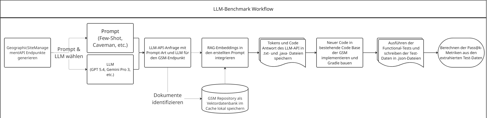

# LLM-Benchmark



Ein Repository zur Generierung, Speicherung und Auswertung von LLM-generiertem Java-Code im Kontext eines bestehenden Java/Spring-Boot-Projekts.

## Überblick

Dieses Projekt nutzt LLM-Modelle zur automatischen Erzeugung von Java-Code und unterstützt einen Workflow zur Integration in ein externes GSM-Projekt sowie zur Auswertung der Ergebnisse.

Der Fokus liegt auf:
- Generierung von Java-Code mithilfe von LLMs
- Speicherung der generierten Ergebnisse im Ordner `generated_code`
- Integration in ein Java-Projekt via `benchmark_runner.py`
- Auswertung mit Pass@K- und Testdatenanalyse

## Projektstruktur

```
.
├── llm_request_handler.py    # LLM-Anfragen und Generierung von Java-Code
├── benchmark_logger.py      # Einfacher Logger für den Benchmark-Workflow
├── benchmark_runner.py      # Steuerung des Workflows und GSM-Integration
├── extract_test_data.py     # Extraktion und Konvertierung von Testdaten aus XML-Dateien
├── gsm_runner.py            # Starten der GSM Spring Boot Anwendung
├── passatk.py               # Berechnung der Pass@K-Metrik
├── prompt.py                # Prompt-Klasse zur Beschreibung von Anfragen
├── requirements.txt         # Python-Abhängigkeiten
├── reports/                 # Berichte und Logdateien
├── generated_code/          # Erzeugte Code-Ausgaben (Laufzeit)
├── llm-benchmark-bruno/     # Zusatzdaten / Konfigurationsordner
├── Pass@k-Benchmark.jpg     # Diagramm zum Workflow
└── README.md                # Dieses Dokument
```

## Module

### `llm_request_handler.py`

Führt die Anfrage an ein LLM durch und speichert die Antwort als Java-Code sowie Metadaten.

Wichtig:
- Verwendet `langchain`, `langfuse` und `python-dotenv`
- Speichert Ergebnisse unter `generated_code/{model}/{prompt_type}/{use_case}/`
- Legt eine `.txt`-Datei mit Token-Nutzung, Prompt und System-Prompt an
- Legt eine `.java`-Datei mit dem generierten Java-Code an

### `benchmark_runner.py`

Koordiniert den Benchmark-Workflow und die Integration in das GSM-Projekt.

Hauptaufgaben:
- Definiert LLM-Modelle und Prompts
- Ruft `llm_request()` für die Code-Generierung auf
- Liest generierten Code und schreibt ihn in eine existierende Java-Datei des GSM-Projekts
- Unterstützt Build- und Test-Schritte für das Zielprojekt

Hinweis:
- In `benchmark_runner.py` sind Pfade zu einem lokalen GSM-Workspace definiert und müssen für den eigenen Rechner angepasst werden.

### `gsm_runner.py`

Startet das GSM Spring Boot Projekt mit dem Maven Wrapper (`mvnw.cmd`).

### `passatk.py`

Berechnet die Pass@K-Metrik zur Auswertung der generierten Tests.

Funktionen:
- `calculate_pass_at_k(n, c, k)`
- `pass_at_k(k, testdata)`

### `prompt.py`

Definiert die `Prompt`-Klasse zur sauberen Kapselung von:
- `prompt_type`
- `use_case`
- `prompt`

### `benchmark_logger.py`

Ein einfacher Logger, der Meldungen mit Zeitstempel in eine Logdatei schreibt.

### `extract_test_data.py`

Extrahiert Testergebnisse aus XML-Dateien der GSM Functional Tests und speichert sie als JSON.

## Workflow

1. Definiere Modelle und Prompts in `benchmark_runner.py`.
2. Rufe `llm_request()` aus `llm_request_handler.py` auf, um Java-Code zu generieren.
3. Speichere generierten Code in `generated_code/{model}/{prompt_type}/{use_case}/`.
4. Integriere den generierten Code in das GSM-Projekt via `benchmark_runner.py`.
5. Optional: Starte die GSM-Anwendung mit `gsm_runner.py`.
6. Extrahiere Testdaten mit `extract_test_data.py` und berechne Pass@K mit `passatk.py`.

## Beispiel

```python
from llm_request_handler import llm_request
from prompt import Prompt

llm_request(
    model_name="openai:WARN-GLOBAL_gemini-3-pro-preview",
    user_prompt=Prompt(
        prompt_type="few_shot",
        use_case="Addition",
        prompt="Implementiere die Methode add(int a, int b), die zwei Zahlen addiert und das Ergebnis zurückgibt."
    ),
    system_prompt="Your task is to generate java code for the given user prompt. Only generate java code and nothing else.",
    tools=None
)
```

## Konfiguration

- Erstelle optional eine `.env`-Datei für API-Keys und Umgebungsvariablen.
- Passe die Pfade in `benchmark_runner.py` und `extract_test_data.py` an dein lokales GSM- und Testprojekt an.

## Anforderungen

- Python 3.8+
- `langchain`
- `langfuse`
- `python-dotenv`
- Zugriff auf LLM-APIs

### Installation

```bash
pip install -r requirements.txt
```

## Hinweise

- `ai_unittest.py` ist nicht Teil dieses Repositories.
- Das Projekt setzt lokale Pfade für GSM und Testdaten voraus und ist daher vor dem Einsatz anzupassen.
- `generated_code/` wird zur Laufzeit erzeugt.

## Lizenz

Dieses Projekt ist Teil einer Bachelor-Arbeit.
